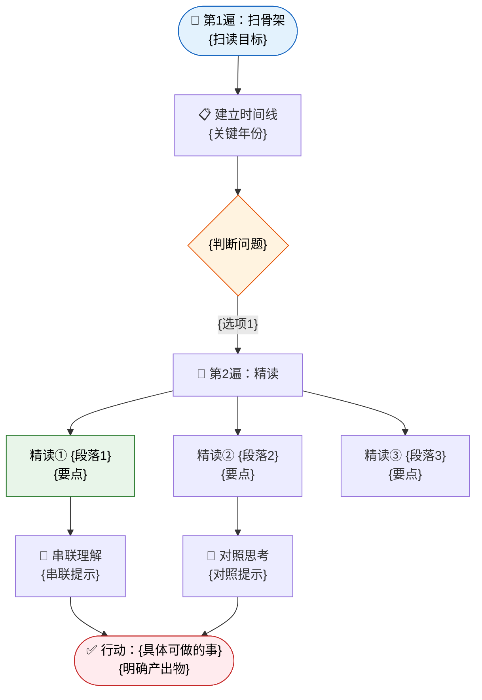

# Wiki 层级架构（通用抽象模板）

> 适用于任意书籍、任意岗位数、任意章节数的知识库发布。将具体值参数化，避免硬编码。

## 1. Wiki 树形结构（抽象模式）

```
{知识空间}/
├── 根目录页（index — 全局导航）
│   ├── 书名 + 一句话定位
│   └── 按岗位入口（表格链接）
├── {岗位A}阅读引导/
│   ├── 目录页（岗位级导航）
│   │   ├── 新手引导区（表格：章节 | 阅读引导文档链接）
│   │   └── 老手引导区（表格：章节 | 阅读引导文档链接）
│   ├── 引言 — {岗位A}新手引导
│   ├── 引言 — {岗位A}老手引导
│   ├── 第1章 — {岗位A}新手引导
│   ├── 第1章 — {岗位A}老手引导
│   └── ... (N 章节 × 2 层级 = 每岗位 2N 篇文档)
├── {岗位B}阅读引导/
│   └── ... (同上结构)
├── {岗位C}阅读引导/
│   └── ...
└── 读书会/
    ├── 计划总览
    ├── 积分规则
    └── 每周主题/
        ├── 第1周
        └── ...
```

**参数说明**：
- `{知识空间}`：飞书知识库空间 ID，或 `my_library`
- `{岗位X}`：由用户配置的角色列表，数量不限（1~N）
- 章节列表：从书的目录自动提取，包含引言、正文章节、尾声
- 每岗位固定 2 个层级：新手 + 老手

## 2. 目录页模板

### 2.1 根目录页（全局 index）

```markdown
# {书名}

{一句话定位}

## 按岗位阅读

| 岗位 | 阅读引导入口 |
|------|-------------|
| {岗位A} | [{岗位A}阅读引导](wiki_url) |
| {岗位B} | [{岗位B}阅读引导](wiki_url) |
| ... | ... |

## 读书会

- [计划总览](wiki_url)
- [积分规则](wiki_url)
```

### 2.2 岗位目录页（岗位级 index）

```markdown
# {岗位名}阅读引导

## 新手引导

**推荐阅读路径**：{按章节顺序的阅读建议}

| 章节 | 阅读引导文档 |
|------|-------------|
| 引言 | [引言 — {岗位}新手引导](wiki_url) |
| 第1章 {章节名} | [第1章 — {岗位}新手引导](wiki_url) |
| 第2章 {章节名} | [第2章 — {岗位}新手引导](wiki_url) |
| ... | ... |
| 尾声 | [尾声 — {岗位}新手引导](wiki_url) |

## 老手引导

**推荐阅读路径**：{按章节顺序的阅读建议}

| 章节 | 阅读引导文档 |
|------|-------------|
| 引言 | [引言 — {岗位}老手引导](wiki_url) |
| 第1章 {章节名} | [第1章 — {岗位}老手引导](wiki_url) |
| ... | ... |
| 尾声 | [尾声 — {岗位}老手引导](wiki_url) |
```

**排序规则**：
1. 引言始终排第一
2. 正文章节按章节号升序
3. 尾声始终排最后
4. 如有附录/后记，排在尾声之后

**表格格式**：统一使用 `| 章节 | 阅读引导文档 |` 两列格式，链接用 `[显示文本](wiki_url)` 格式。

## 3. 发布管线（四阶段）

### Phase 1: Scaffold（搭骨架）

创建所有目录页，建立 wiki 层级结构。

```
操作序列：
1. create-doc → 根目录页（wiki_space={知识空间}）
2. 对每个岗位：
   a. create-doc → 岗位目录页（wiki_node=根目录页node）
   c. create-doc → 读书会计划总览（wiki_node=根目录页node）
   d. create-doc → 积分规则（wiki_node=根目录页node）
```

**产出物**：空的目录页树，链接位留占位符。

### Phase 2: Populate（填内容）

逐章逐岗位生成引导文档，上传到对应岗位目录下。

```
操作序列：
对每个 {章节} × {岗位} × {层级}：
  1. 按模板生成引导文档内容
  2. create-doc → 文档（wiki_node=岗位目录页node）
  3. 记录 doc_id 用于后续接线
```

**产出物**：所有引导文档已创建，但目录页中链接仍为占位符。

### Phase 3: Wire（接线）

用实际文档链接更新所有目录页。

```
操作序列：
1. 根目录页：update-doc → 填入各岗位目录页链接
2. 对每个岗位目录页：update-doc → 填入各章节引导文档链接
```

**产出物**：所有链接就位，用户可通过目录页导航到任意引导文档。

### Phase 4: Maintain（维护）

后续新增引导文档时更新索引。

```
操作序列：
1. create-doc → 新文档（wiki_node=岗位目录页node）
2. update-doc → 岗位目录页追加表格行
```

## 4. 飞书实现细节

### 4.1 MCP 工具映射

| 操作 | 工具 | 关键参数 |
|------|------|---------|
| 创建根目录页 | `mcp__feishu__create-doc` | `wiki_space={空间ID}` |
| 创建子页 | `mcp__feishu__create-doc` | `wiki_node={父节点token}` |
| 更新目录页链接 | `mcp__feishu__update-doc` | `mode=replace_range`，精确定位占位符 |
| 追加表格行 | `mcp__feishu__update-doc` | `mode=insert_after`，定位到表格最后一行 |
| 验证层级 | `mcp__feishu__list-docs` | `doc_id={父节点}` |

### 4.2 白板管线类型

| 可视化类型 | 生成管线 | 输入格式 |
|-----------|---------|---------|
| 脑图 | Mermaid mindmap → whiteboard-cli → lark-cli | Mermaid mindmap |
| 时间线 | DSL timeline.json → whiteboard-cli → lark-cli | JSON DSL |
| 阅读路径 | Mermaid flowchart → whiteboard-cli → lark-cli | Mermaid flowchart |
| 三层洞察 | DSL three-layer.json → whiteboard-cli → lark-cli | JSON DSL |

画板通过 `<whiteboard type="blank"></whiteboard>` 嵌入文档，或用 `<image url="...">` 引用导出图片。

### 4.3 端到端执行流程

```
1. 生成内容 → 按模板产出画板文件（.mmd / .json）
2. 创建文档 → lark-cli docs +create（含 <whiteboard type="blank"> 占位）→ 返回 board_tokens
3. 上传画板 → 管道直传（见 §4.5），不落盘中间文件
4. 验证上线 → fetch-doc 确认画板渲染正常
```

Mermaid 管线（脑图/阅读路径）：`whiteboard-cli --to openapi -i {input}.mmd --from mermaid | lark-cli docs +whiteboard-update --whiteboard-token {TOKEN} --yes --as user`
DSL 管线（时间线/三层洞察）：`whiteboard-cli --to openapi -i {input}.json | lark-cli docs +whiteboard-update --whiteboard-token {TOKEN} --yes --as user`

### 4.4 画板输入格式模板

每种画板提供一个最小可运行示例，用 `{占位符}` 标记需替换的值。

#### 脑图（Mermaid mindmap）
```mermaid
mindmap
  root(({章节名}·{核心隐喻}<br/>你拿走①{产出物1} ②{产出物2} ③{产出物3}))
    {主题A}
      {洞察A1}
      自检 {岗位自检问题A}
    {主题B}
      {洞察B1}
      自检 {岗位自检问题B}
    {主题C}
      {洞察C1}
      自检 {岗位自检问题C}
```

#### 时间线（DSL JSON）
```json
{"version": 2, "nodes": [{"type": "frame", "id": "root",
  "width": 1300, "height": 280, "layout": "vertical", "gap": 10, "padding": 20,
  "children": [
    {"type": "frame", "id": "cards-row", "width": 1260, "height": 120, "layout": "none",
      "children": [
      {"type": "frame", "id": "card-1", "x": 10, "y": 0,
        "width": 155, "height": 120, "layout": "vertical", "gap": 4, "padding": 10,
        "fillColor": "{色填充}", "borderColor": "{色边框}", "borderWidth": 2, "borderRadius": 8,
        "children": [
          {"type": "text", "width": 135, "height": "fit-content", "text": "{年份}",
            "fontSize": 18, "textColor": "{色边框}", "fontWeight": "bold", "textAlign": "center"},
          {"type": "text", "width": 135, "height": "fit-content", "text": "{事件标题}",
            "fontSize": 13, "textColor": "#1F2329", "textAlign": "center"},
          {"type": "text", "width": 135, "height": "fit-content", "text": "{洞察}",
            "fontSize": 11, "textColor": "#646A73", "textAlign": "center"}]}]},
    {"type": "frame", "id": "axis", "width": 1260, "height": 20, "layout": "none",
      "children": [
        {"type": "frame", "id": "line", "x": 10, "y": 8, "width": 1235, "height": 3,
          "layout": "none", "fillColor": "#BBBFC4", "borderRadius": 2},
        {"type": "frame", "id": "dot-1", "x": 81, "y": 3, "width": 14, "height": 14,
          "layout": "none", "fillColor": "{色边框}", "borderRadius": 7}]}
  ]}]}
```

#### 阅读路径（Mermaid flowchart）


#### 三层洞察（DSL JSON）
```json
{"version": 2, "nodes": [{"type": "frame", "id": "root",
  "width": 1200, "height": "fit-content", "layout": "vertical", "gap": 24, "padding": 40,
  "children": [
    {"type": "text", "width": 1120, "height": "fit-content",
      "text": "知识 → 映射 → 行动", "fontSize": 24, "textColor": "#1F2329", "textAlign": "center"},
    {"type": "frame", "id": "layer1", "width": "fill-container", "height": "fit-content",
      "layout": "vertical", "gap": 12, "padding": 20,
      "fillColor": "#F0F4FC", "borderColor": "#5178C6", "borderWidth": 2, "borderRadius": 8,
      "children": [
        {"type": "text", "width": 200, "height": "fit-content",
          "text": "📚 知识层", "fontSize": 20, "textColor": "#5178C6"},
        {"type": "frame", "id": "cards", "width": "fill-container", "height": "fit-content",
          "layout": "horizontal", "gap": 16, "alignItems": "stretch",
          "children": [
            {"type": "frame", "width": "fill-container", "height": "fit-content",
              "layout": "vertical", "gap": 8, "padding": 16, "fillColor": "#FFFFFF",
              "borderColor": "#5178C6", "borderWidth": 2, "borderRadius": 8,
              "children": [
                {"type": "text", "width": "fill-container", "height": "fit-content",
                  "text": "{卡片标题}", "fontSize": 16, "textColor": "#1F2329", "textAlign": "center"},
                {"type": "text", "width": "fill-container", "height": "fit-content",
                  "text": "{洞察}", "fontSize": 13, "textColor": "#646A73", "textAlign": "center"}]}]}]},
    {"type": "frame", "id": "arrow1", "width": 1120, "height": "fit-content",
      "layout": "vertical", "gap": 4, "alignItems": "center",
      "children": [
        {"type": "text", "width": 40, "height": "fit-content", "text": "⬇",
          "fontSize": 24, "textColor": "#5178C6", "textAlign": "center"},
        {"type": "text", "width": 300, "height": "fit-content",
          "text": "{映射提示语}", "fontSize": 13, "textColor": "#646A73", "textAlign": "center"}]}
  ]}]}
```

层色：知识层蓝(#5178C6)、映射层绿(#509863)、行动层黄(#D4B45B)。每层结构相同，复制替换颜色即可。

### 4.5 CLI 命令参考

```bash
# PNG 预览（可选验证）
npx -y @larksuite/whiteboard-cli@^0.2.11 -i {input}.json -o {output}.png
# Mermaid → OpenAPI（注意 --from 不是 --format）
npx -y @larksuite/whiteboard-cli@^0.2.11 --to openapi -i {input}.mmd --from mermaid
# 创建含画板占位文档 → 返回 doc_id + board_tokens
lark-cli docs +create --as user --title '{标题}' \
  --markdown '{内容}...<whiteboard type="blank"></whiteboard>...'
# 覆盖重建文档（慎用）
lark-cli docs +update --doc {DOC_ID} --mode overwrite --markdown "$MARKDOWN"
```

**lark-cli 旗标**：`--doc TOKEN` / `--mode {append|overwrite|replace_range}` / `--selection-by-title`（下划线不行） / `--selection-with-ellipsis "start...end"` / `--whiteboard-token TOKEN` / `--as user|bot`。

### 4.6 错误处理与降级
DSL validation failed → 只用 frame+text；画板矮扁 → layout:none 用固定 height；"unmarshal array" → 传完整 openapi 输出；上传失败 → 管道直传不落盘；429 → 等重置时间；401/403 → --as user；中文引号 → 用「」。

**降级**：画板渲染失败 → Mermaid 绕过 DSL；画板上传失败 → 降级 PNG 图片嵌入；目录链接错误 → overwrite 重建（不用 replace_all 避免误伤）。

### 4.7 批量生产流水线

**并行策略**：画板上传命令互不依赖，可并行（单命令约 3-5 秒，4 画板并行约 5 秒）。按岗位分 Agent，每组负责若干岗位的文档创建+画板上传。

| 规模 | 建议 |
|------|------|
| 单文档 4 画板 | 4 个画板并行上传 |
| 单章 N 岗位 | 按岗位分 2-3 个 Agent 并行 |
| 多章批量 | 每章一个 Agent，Agent 间并行 |
| 超大批量(>80文档) | 分批执行，每批不超过 6 章，避免触发 rate limit |

**速率限制**：连续创建约 80+ 文档后可能触发 429。错误消息会告知精确重置时间，被限流的 Agent 延后重跑即可。

**进度追踪**：每章完成后记录 doc_id + board_tokens + 画板类型映射 + 成功/失败状态。失败项加入重试队列。

## 5. 命名规则

| 对象 | 格式 | 示例 |
|------|------|------|
| 文档标题 | `{章节名} — {岗位}{层级}引导` | `引言 — {岗位}新手引导` |
| 文件标识 | `{chapter}-{role}-{level}` | `intro-{role}-beginner` |
| 岗位目录页标题 | `{岗位名}阅读引导` | `{岗位}阅读引导` |
| 根目录页标题 | `{书名}` | `{书名}` |
| 读书会子页 | `{主题}` | `计划总览`、`积分规则` |

**章节标识映射**：
- 引言 → `intro`
- 第N章 → `ch{N}`（补零按章节数决定：≤9 章不补零，≥10 章补零如 `ch01`）
- 尾声 → `epilogue`
- 附录 → `appendix`

**层级标识**：
- 新手 → `beginner`
- 老手 → `advanced`

## 6. 扩展性设计

### 6.1 岗位数弹性

| 岗位数 | 策略 |
|-------|------|
| 1 | 根目录页直接链接该岗位目录，无需表格 |
| 2~5 | 标准表格，每岗位一行 |
| 6~15 | 表格分组：按职能分类（技术线/业务线/管理线） |
| 16+ | 增加中间层目录页（按职能大类分组），避免单页过长 |

### 6.2 章节数弹性

| 章节数 | 策略 |
|-------|------|
| ≤10 | 单页表格，所有章节平铺 |
| 11~25 | 表格按部分分组（如"第一部分：基础"） |
| 26+ | 增加子目录页，按书的部分(Part)拆分为多个子表格 |

### 6.3 多书场景

| 场景 | 策略 |
|------|------|
| 单本书 | 一个知识空间，根目录即书名 |
| 多本书（同主题） | 一个知识空间，根目录是主题导航，每本书一个子空间 |
| 多本书（不同主题） | 每本书独立知识空间，通过外部索引页串联 |

### 6.4 新增岗位模板

新增岗位不需要重构已有层级，只需：
1. 在根目录页表格追加一行
2. 创建新岗位目录页（从模板复制）
3. 逐章生成新岗位的引导文档
4. 更新新岗位目录页链接

已有岗位的文档和目录不受影响。

## 7. 跨平台映射

本架构可映射到其他知识管理平台：

| 概念 | 飞书 | Notion | Confluence | 本地 Markdown |
|------|------|--------|------------|--------------|
| 知识空间 | Wiki Space | Workspace | Space | 根目录 |
| 目录页 | Wiki 文档 | Database + Page | Page | README.md |
| 层级关系 | wiki_node | Sub-page | Child page | 子目录 |
| 导航表格 | Markdown 表格 | Database View | Page Properties | Markdown 表格 |
| 岗位分组 | 子文档 | Database Filter | Label/Tag | 子目录 |
| 链接 | wiki_url | notion_url | confluence_url | 相对路径 |

**核心差异**：
- **Notion**：可用 Database 视图替代表格，支持筛选/排序，但需要预先定义 schema
- **Confluence**：支持 Label 标签系统，可按标签聚合，但层级深度受限
- **本地 Markdown**：最简实现，目录结构即层级，但无自动导航
